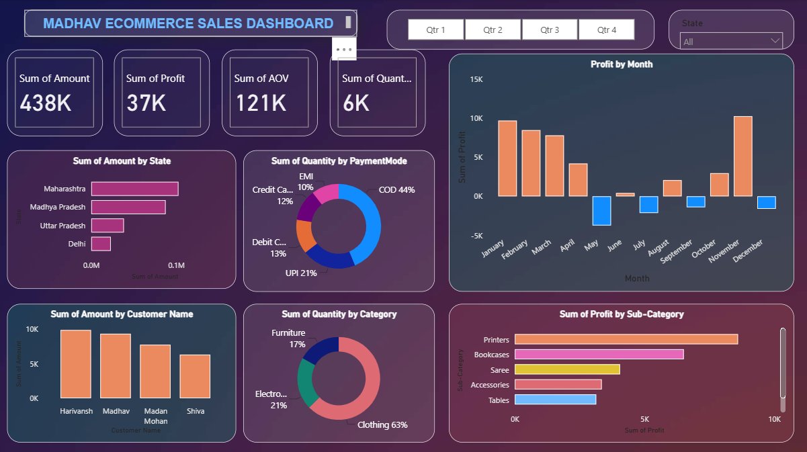

# Madhav Ecommerce Sales Dashboard — Power BI

An interactive **E-commerce Sales Analytics dashboard developed in Microsoft Power BI** to analyze sales performance, profitability, customer behavior, product categories, payment preferences, and regional performance.

---

## 📊 Dashboard Preview



---

## 🎯 Project Objective

The objective of this project is to transform e-commerce sales data into an interactive business intelligence dashboard that enables users to monitor key performance indicators and explore sales and profitability patterns across customers, products, locations, and time periods.

The dashboard focuses on **descriptive and diagnostic sales analytics** using Power BI.

---

## 📌 Dashboard KPIs

The dashboard provides an overview of key business indicators including:

- Total Sales — 438K
- Total Profit — 37K
- Total Quantity — 6K
- Average Order Value (AOV)
- Monthly Profit Performance

---

## 🔍 Analysis Areas

The dashboard analyzes business performance across:

- Sales by State
- Sales by Customer
- Profit by Month
- Profit by Product Sub-Category
- Quantity by Product Category
- Quantity by Payment Mode
- Quarterly Performance

### Interactive Filters

Users can dynamically explore the dashboard using:

- Quarter filters — Q1, Q2, Q3 and Q4
- State filter

---

## 💡 Key Insights

The dashboard helps identify:

- Geographic differences in sales performance
- Top-performing customers by sales value
- Monthly profit trends and loss-making periods
- Product sub-categories contributing most to profit
- Distribution of sales quantity across product categories
- Customer payment-mode preferences
- Changes in business performance across quarters

These insights represent **historical patterns within the dataset** and are intended for analytical and portfolio demonstration purposes.

---

## 🛠️ Tools & Skills Demonstrated

**Business Intelligence:** Microsoft Power BI

**Data Transformation:** Power Query

**Data Modeling:** Power BI Data Model

**Analytics:** Sales Analytics • Profitability Analysis • Customer Analysis • Product Analysis

**Visualization:** KPI Cards • Bar Charts • Donut Charts • Monthly Trend Charts • Interactive Slicers

---

## 💼 Business Application

This dashboard demonstrates how Power BI can support e-commerce and business teams with:

- Sales performance monitoring
- Profitability analysis
- Customer analysis
- Product performance evaluation
- Regional sales analysis
- Payment behavior analysis
- Management reporting
- Data-driven business decision-making

---

## 📁 Repository Structure

```text
Madhav-Ecommerce-Sales-PowerBI/
│
├── README.md
│
├── dashboard/
│   └── Madhav_Ecommerce_Sales_Dashboard.pbix
│
└── images/
    └── dashboard_overview.png
```

---

## 👤 Author

**Obaid Ayoub**

MBA — Human Resource Management & Finance

HR & People Analytics | Data Analytics | Power BI

[LinkedIn](https://www.linkedin.com/in/obaid-ayoub)
